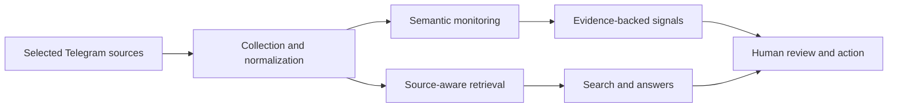

# SENSOR — Telegram Intelligence Platform

**Production product case study** 
Website: [sensor-tg.tech](https://sensor-tg.tech)

## Origin

SENSOR began with a personal research problem. While following many crypto Telegram chats, I kept losing useful context in fast-moving discussions. I wanted something closer to NotebookLM for the conversations I read: a way to collect messages, search them semantically, ask questions with source context, and return to relevant discussions without scrolling for hours.

The first version was a tool for my own workflow. Once the chats became searchable, a broader opportunity emerged: teams also need to notice relevant commercial conversations early, understand why they matter, and turn them into actionable signals.

That evolution became SENSOR: a platform for Telegram intelligence, semantic monitoring, and lead generation.

## The problem

Telegram is useful for research, communities, and B2B conversations, but it is difficult to work with at scale:

- relevant messages disappear in high-volume chats;
- the same business need can be phrased in many different ways;
- keyword alerts generate noise without enough context;
- useful history is hard to revisit, compare, or search;
- teams need to review a signal before acting on it.

## Product approach

SENSOR connects selected Telegram sources and turns the resulting discussions into a reviewable intelligence workflow.

The system supports:

- semantic lead detection alongside keyword-based monitoring;
- historical scans and continuous monitoring of selected chats and channels;
- source-aware conversational search over collected Telegram discussions;
- evidence quotes and links back to the original context for review;
- audience and source research workflows for teams that need to understand a community before outreach;
- scheduled digests and recurring intelligence tasks.

## Engineering decisions

The difficult part was not assigning an LLM score to a message. It was making the output useful and reviewable in a real workflow.

### Semantic matching over brittle keyword rules

People rarely describe a commercial need using the same words. SENSOR combines conventional matching with semantic evaluation so that the system can account for the request, nearby context, and the user’s intent rather than a single phrase.

### Evidence before automation

Each signal is designed to be checked against the original message and surrounding discussion. The goal is not to treat model output as ground truth, but to help a person spend attention on the conversations most likely to matter.

### Production boundaries

The product handles private operational data and long-running collection workflows. The implementation therefore includes tenant-scoped access, encrypted Telegram sessions, background processing, quota and billing controls, and feedback loops for improving signal quality over time.

## My role

I am the founder and applied AI engineer behind SENSOR. I own the product and engineering cycle:

- user research and product design;
- system architecture and backend development;
- Telegram account, bot, and data-collection integrations;
- LLM and retrieval workflows;
- PostgreSQL data model, security boundaries, billing, deployment, and maintenance;
- feedback-driven iteration with users.

## Technology

Python, FastAPI, PostgreSQL, async SQLAlchemy, Telethon, Pyrogram, python-telegram-bot, Google Gemini, retrieval workflows, React/TypeScript, Docker, nginx, Linux/VPS, and pytest.

## Public case-study boundary

SENSOR is an active commercial product. This case study intentionally describes the product and the engineering decisions at a high level; it does not publish source code, customer data, Telegram sessions, secrets, or operational infrastructure details.
